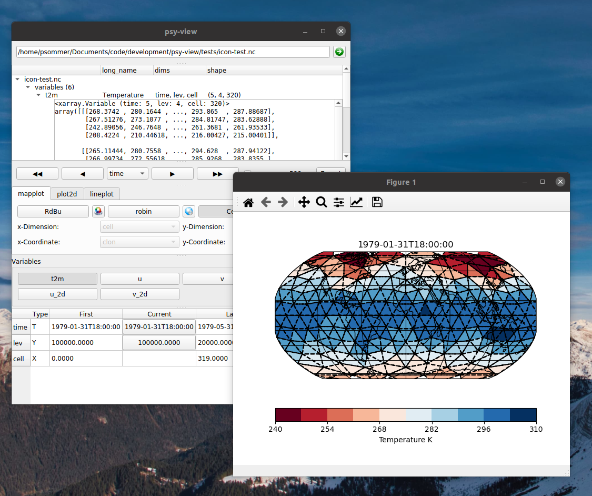

=========================================
psy-view: An ncview-like GUI with psyplot
=========================================

.. start-badges

.. list-table::
    :stub-columns: 1
    :widths: 10 90

    * - examples
      - |mybinder|
    * - tests
      - |travis| |appveyor| |codecov|
    * - package
      - |conda| |github|

.. |mybinder| image:: https://mybinder.org/badge_logo.svg
   :target: https://mybinder.org/v2/gh/psyplot/psy-view/master?urlpath=%2Fdesktop
   :alt: mybinder.org

.. |travis| image:: https://travis-ci.org/psyplot/psy-view.svg?branch=master
    :alt: Travis
    :target: https://travis-ci.org/psyplot/psy-view

.. |appveyor| image:: https://ci.appveyor.com/api/projects/status/a7qxvvwt0e41j32h/branch/master?svg=true
    :alt: AppVeyor
    :target: https://ci.appveyor.com/project/psyplot/psy-view/branch/master

.. |codecov| image:: https://codecov.io/gh/psyplot/psy-view/branch/master/graph/badge.svg
    :alt: Coverage
    :target: https://codecov.io/gh/psyplot/psy-view

.. |conda| image:: https://anaconda.org/psyplot/psy-view/badges/version.svg
    :alt: conda
    :target: https://anaconda.org/conda-forge/psyplot

.. |github| image:: https://img.shields.io/github/release/psyplot/psy-view.svg
    :target: https://github.com/psyplot/psy-view/releases/latest
    :alt: Latest github release

.. end-badges

This package defines a viewer application for netCDF files, that is highly
motivated by the ncview_ package but entirely built upon the psyplot framework.
It supports strucutured and unstructured grids and provides an intuitive
graphical user interface to quickly dive into the data inside a netCDF file.

.. _ncview: http://meteora.ucsd.edu/~pierce/ncview_home_page.html

**This package is currently under development and we highly appreciate your
feedback! Please try it out yourself and, if you would like to see more features,
find bugs or want to say anything else, please leave your comments and
experiences at https://github.com/psyplot/psy-view/issues or send a mail at
psyplot@hzg.de.**

Features
--------
Some of the most important features offered by psy-view are:

- intuitive GUI to select variables, dimensions, slices, etc. and change the
  plot
- automatically decodes CF-conventions and supports unstructured grid, such as
  ICON or UGRID
- animation interface
- different projections
- implemented in psyplot-gui_ for full flexibility (if desired)

.. _psyplot-gui: https://psyplot.readthedocs.io/projects/psyplot-gui

Test it without installation
----------------------------
You can try the functionalities with some selected example files headless in
your browser by clicking on |mybinder|. Note that it might take a bit to load
and that the speed depends on your WiFi-connection.

Installation
------------
To install the current work-in-progress, please

1. download Miniconda_
2. create a new environment via::

      conda create -n psy-view -c psyplot/label/master -c conda-forge --override-channels psy-view 'cartopy<0.18'
    
   **There is currently an incompatibility with cartopy 0.18 (see https://github.com/psyplot/psy-maps/issues/20), but we are working on it**

3. activate this environment via::

      conda activate psy-view

4. open the application via::

      psy-view

  or::

      psy-view <path-to-your-netcdf-file.nc>

  See ``psy-view --help`` for more options

.. _Miniconda: https://conda.io/en/latest/miniconda.html

As an alternativ to a local installation, you can also run it 
headless in you browser by clicking |mybinder|

Updating psy-view
+++++++++++++++++
To update the development version, make sure you also update the 
other dependencies. This can be don via::

    conda update -n psy-view -c psyplot/label/master -c conda-forge \
        --override-channels psy-view psy-maps psy-simple psyplot-gui psyplot

If this does not work, you can also simply recreate the conda environment 
using the command from above::

    conda create -n psy-view -c psyplot/label/master -c conda-forge --override-channels psy-view
