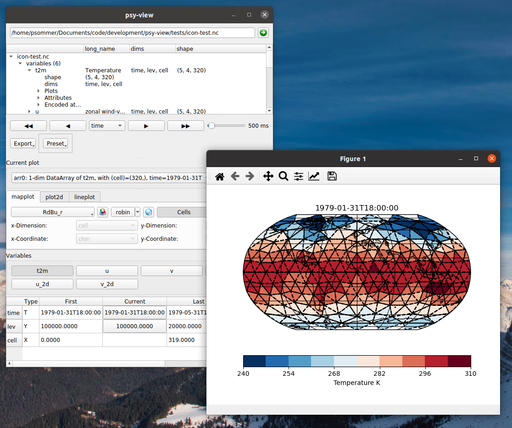

=========================================
psy-view: An ncview-like GUI with psyplot
=========================================

.. start-badges

.. list-table::
    :stub-columns: 1
    :widths: 10 90

    * - examples
      - |mybinder|
    * - tests
      - |travis| |appveyor| |codecov|
    * - package
      - |version| |conda| |supported-versions| |supported-implementations| |github|
    * - get in touch
      - |gitter| |mailing-list| |issues|

.. |mybinder| image:: https://mybinder.org/badge_logo.svg
   :target: https://mybinder.org/v2/gh/psyplot/psy-view/master?urlpath=%2Fdesktop
   :alt: mybinder.org

.. |travis| image:: https://travis-ci.org/psyplot/psy-view.svg?branch=master
    :alt: Travis
    :target: https://travis-ci.org/psyplot/psy-view

.. |appveyor| image:: https://ci.appveyor.com/api/projects/status/a7qxvvwt0e41j32h/branch/master?svg=true
    :alt: AppVeyor
    :target: https://ci.appveyor.com/project/psyplot/psy-view/branch/master

.. |codecov| image:: https://codecov.io/gh/psyplot/psy-view/branch/master/graph/badge.svg
    :alt: Coverage
    :target: https://codecov.io/gh/psyplot/psy-view

.. |conda| image:: https://anaconda.org/conda-forge/psy-view/badges/version.svg
    :alt: conda
    :target: https://anaconda.org/conda-forge/psy-view

.. |github| image:: https://img.shields.io/github/release/psyplot/psy-view.svg
    :target: https://github.com/psyplot/psy-view/releases/latest
    :alt: Latest github release

.. |version| image:: https://img.shields.io/pypi/v/psy-view.svg?style=flat
    :alt: PyPI Package latest release
    :target: https://pypi.python.org/pypi/psy-view

.. |supported-versions| image:: https://img.shields.io/pypi/pyversions/psy-view.svg?style=flat
    :alt: Supported versions
    :target: https://pypi.python.org/pypi/psy-view

.. |supported-implementations| image:: https://img.shields.io/pypi/implementation/psy-view.svg?style=flat
    :alt: Supported implementations
    :target: https://pypi.python.org/pypi/psy-view

.. |gitter| image:: https://img.shields.io/gitter/room/psyplot/community.svg?style=flat
    :target: https://gitter.im/psyplot/community
    :alt: Gitter

.. |mailing-list| image:: https://img.shields.io/badge/join-mailing%20list-brightgreen.svg?style=flat
    :target: https://www.listserv.dfn.de/sympa/subscribe/psyplot
    :alt: DFN mailing list

.. |issues| image:: https://img.shields.io/github/issues-raw/psyplot/psy-view.svg?style=flat
    :target: https://github.com/psyplot/psy-view/issues
    :alt: GitHub issues

.. end-badges

This package defines a viewer application for netCDF files, that is highly
motivated by the ncview_ package but entirely built upon the psyplot framework.
It supports strucutured and unstructured grids and provides an intuitive
graphical user interface to quickly dive into the data inside a netCDF file.

.. _ncview: http://meteora.ucsd.edu/~pierce/ncview_home_page.html

**This package is currently under development and we highly appreciate your
feedback! Please try it out yourself and, if you would like to see more features,
find bugs or want to say anything else, please leave your comments and
experiences at https://github.com/psyplot/psy-view/issues or send a mail to
psyplot@hzg.de.**

Features
--------
Some of the most important features offered by psy-view are:

- intuitive GUI to select variables, dimensions, slices, etc. and change the
  plot
- automatically decodes CF-conventions and supports unstructured grid, such as
  ICON_ or UGRID_
- animation interface
- different projections
- implemented in psyplot-gui_ for full flexibility (if desired)

.. _ICON: https://mpimet.mpg.de/en/communication/news/focus-on-overview/icon-development
.. _UGRID: http://ugrid-conventions.github.io/ugrid-conventions/
.. _psyplot-gui: https://psyplot.readthedocs.io/projects/psyplot-gui

Test it without installation
----------------------------
You can try the functionalities with some selected example files headless in
your browser by clicking on |mybinder|. Note that it might take a bit to load
and that the speed depends on your WiFi-connection.

Installation
------------
To install the current work-in-progress, please

1. download Miniconda_
2. open the terminal (or `Anaconda Prompt` on Windows) and type::

      conda create -n psyplot -c conda-forge psy-view

   On Linux and OS X, you may instead want to type::

      $ conda create -n psyplot -c conda-forge --override-channels psy-view

   in order to not mix the anaconda defaults and and conda-forge channel, because
   mixing them can sometimes cause incompatibilities.
3. The commands above will installed psy-view and all it's necessary
   dependencies into a separate environment. You can activate it via::

      conda activate psy-view

4. Now launch the GUI via typing::

      psy-view

  or::

      psy-view <path-to-your-netcdf-file.nc>

   See ``psy-view --help`` for more options

.. _Miniconda: https://conda.io/en/latest/miniconda.html

As an alternativ to a local installation, you can also run it
headless in you browser by clicking |mybinder|

For alternative installation instructions, update information or deinstallation
instructions, please have a look into the `installation docs`_.

.. _installation docs: https://psyplot.readthedocs.io/projects/psy-view/en/latest/installing.html

Get in touch
------------
Any quesions? Do not hessitate to get in touch with the psyplot developers.

- Create an issue at the `bug tracker`_
- Chat with the developers in out `channel on gitter`_
- Subscribe to the `mailing list`_ and ask for support
- Sent a mail to psyplot@hzg.de

See also the `code of conduct`_, and our `contribution guide`_ for more
information and a guide about good bug reports.

.. _bug tracker: https://github.com/psyplot/psy-view
.. _channel on gitter: https://gitter.im/psyplot/community
.. _mailing list: https://www.listserv.dfn.de/sympa/subscribe/psyplot
.. _code of conduct: https://github.com/psyplot/psyplot/blob/master/CODE_OF_CONDUCT.md
.. _contribution guide: https://github.com/psyplot/psyplot/blob/master/CONTRIBUTING.md

Copyright disclaimer
--------------------
Copyright (C) 2020 Philipp S. Sommer

This program is free software: you can redistribute it and/or modify
it under the terms of the GNU General Public License as published by
the Free Software Foundation, either version 3 of the License, or
(at your option) any later version.

This program is distributed in the hope that it will be useful,
but WITHOUT ANY WARRANTY; without even the implied warranty of
MERCHANTABILITY or FITNESS FOR A PARTICULAR PURPOSE.  See the
GNU General Public License for more details.

You should have received a copy of the GNU General Public License
along with this program.  If not, see https://www.gnu.org/licenses/.
