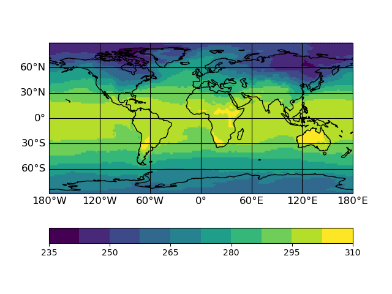

.. _getting-started:

Getting started
===============

.. highlight:: bash

Binder examples
---------------
You can run a demo of psy-view in your webbrowser by clicking |mybinder|. This
will show you a remote desktop (after some time for launching the server) where
you can test psy-view (and the psyplot-gui) for different test files.

.. _binder-upload:

Uploading your own data
^^^^^^^^^^^^^^^^^^^^^^^
You can also upload your own data to visualize it on the binder instance. Once
you see the remote desktop, your URL will be something like
``https://hub.gke2.mybinder.org/user/psyplot-psy-view-.../desktop/?token=...``.

1. open a new tab
2. take the URL from the previous tab and replace the last part from the url
   (``desktop/?token=...``)  with ``tree/Desktop``).
3. Now click the :guilabel:`Upload` button and select the file you want to upload
4. Upload the file
5. The file you uploaded will now appear on the desktop in the previous tab

.. |mybinder| image:: https://mybinder.org/badge_logo.svg
    :target: https://mybinder.org/v2/gh/psyplot/psy-view/master?urlpath=%2Fdesktop
    :alt: mybinder-demo

Run it locally
--------------

Congratulations! You successfully installed psy-view on your system (if not,
head over to :ref:`install`).

This small example shows you, how to make a simple georeferenced plot. You can
use the :download:`demo.nc` file for this demo.

Start the GUI from the command line via::

    psy-view demo.nc

A widget will open that looks like

.. screenshot:: ds_widget docs-getting-started-ds_widget.png

You see a button for the `t2m` variable: |t2m|. Click it, and it opens a plot
like this:

.. ipython::
    :suppress:

    In [1]: import psyplot.project as psy
       ...: with psy.plot.mapplot(
       ...:         "demo.nc", name="t2m",
       ...:         cmap="viridis",
       ...:     ) as sp:
       ...:     sp.export("docs-getting-started-example.png")

Now use the |btn_cmap| button to select a different colormap, edit the
projection via the |btn_proj| button, or update the dimensions via the
navigation buttons: |btn_prev|, |btn_next|, |btn_animate_backward| and
|btn_animate_forward|.

More documentation about the GUI elements is provided in our
:ref:`User guide <user-guide>`. And if you are interested in the python code,
checkout the :ref:`API reference <api>`.

.. |t2m| screenshot:: ds_widget.variable_buttons['t2m'] docs-getting-started-t2m.png
    :height: 1.3em

.. |btn_cmap| screenshot:: ds_widget.plotmethod_widget.btn_cmap docs-getting-started-btn_cmap.png
    :plot:
    :height: 1.3em

.. |btn_proj| screenshot:: ds_widget.plotmethod_widget.btn_proj docs-getting-started-btn_proj.png
    :plot:
    :height: 1.3em

.. |btn_prev| screenshot:: ds_widget.btn_prev docs-btn_prev.png
    :height: 1.3em
    :enable:

.. |btn_next| screenshot:: ds_widget.btn_next docs-btn_next.png
    :height: 1.3em
    :enable:

.. |btn_animate_backward| screenshot:: ds_widget.btn_animate_backward docs-btn_animate_backward.png
    :height: 1.3em
    :enable:

.. |btn_animate_forward| screenshot:: ds_widget.btn_animate_forward docs-btn_animate_forward.png
    :height: 1.3em
    :enable: