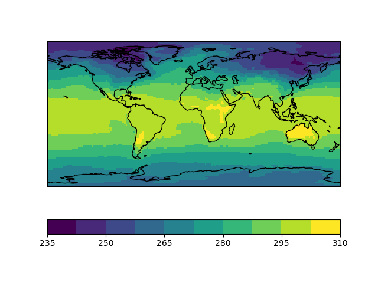
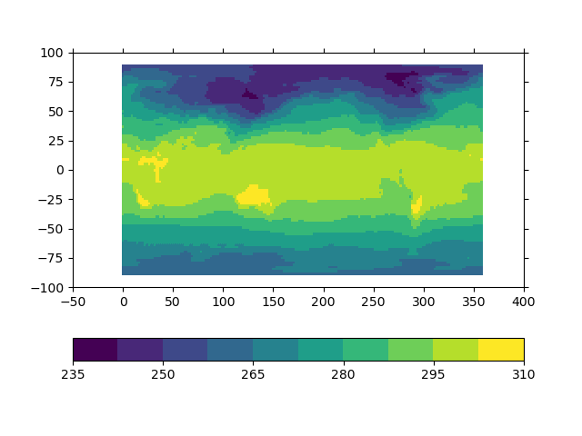
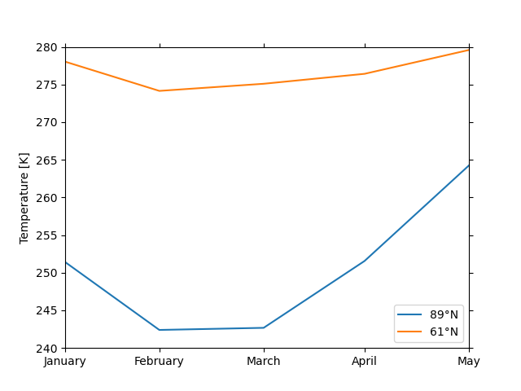
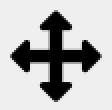

.. _user-guide:

User guide
===============

.. highlight:: bash

Starting the GUI
----------------

Assuming that you :ref:`installed <install>` psy-view, you can start it by
typing::

    $ psy-view

in the terminal (or Anaconda Prompt on Windows). On windows you additionally
have the opportunity to start it from the start menu (just search for
psy-view), assuming that you have :ref:`installed it via conda <install-conda>`.

You can also directly pass a path to a netCDF file, e.g.::

    $ psy-view demo.nc

to open it. You can also directly select a variable for plotting via the
``-n`` option, e.g.::

    $ psy-view demo.nc -n t2m

Please see the section :ref:`command-line` for more information, or type::

    $ psy-view --help

in the terminal.

.. note::

    The psy-view widget is also available from the `psyplot GUI`_. Just type::

        $ psyplot

    in the terminal to start it from there. See also :ref:`psyplot-gui-embed`.

.. _psyplot GUI: https://psyplot.readthedocs.io/projects/psyplot-gui

.. _user-guide-gui:

The GUI
-------

The usage of psy-view should be quite intuitive and this small guide gives you
a quick intro into the central elements. Please let us know if you
encounter any problems.

.. screenshot-figure:: ds_widget docs-ds_widget.png
    :plot:

    psy-views central element: the dataset widget.

The dataset widget is the central element of psy-view. It runs as a standalone
application, or within the psyplot gui (see :ref:`psyplot-gui-embed`).

Resizing the GUI elements
^^^^^^^^^^^^^^^^^^^^^^^^^
The widget is made flexible such that you can adapt the heights of the
individual elements. Just move your cursor between the elements to change their
size.

.. only:: html

    The following screencast illustrates this functionality:

    .. image:: _static/resize-demo.gif

The central elements (from top to bottom) are presented in the next sections.

.. _user-guide-open:

Open a netCDF file
^^^^^^^^^^^^^^^^^^

.. screenshot:: ds_widget.open_widget docs-open_widget.png

Click the |btn_open| button to select a netCDF file from the disk, or directly
enter the path in the line widget. You can open multiple datasets at the
same time within the widget. The selection of the current dataset can be
done through the dataset tree (see below)

.. |btn_open| screenshot:: ds_widget.btn_open docs-btn_open.png
    :width: 1.3em

.. _user-guide-ds_tree:

View the dataset
^^^^^^^^^^^^^^^^

.. screenshot:: ds_widget.ds_tree docs-ds_tree.png

Here you can see all open datasets and select the one you want  to
visualize. Expand the items to get more information about variables and
their attributes.

.. _user-guide-navigation:

Navigate and export
^^^^^^^^^^^^^^^^^^^

.. screenshot:: ds_widget.navigation_box.parentWidget() docs-navigation.png
    :plot:

In the top row, you can increase or decrease the dimension of the plotted variable.
Clicking |btn_prev| (or |btn_next|) decreases (or increases) the selected
dimension, whereas |btn_animate_backward| and |btn_animate_forward| makes an
animation. You can control the speed (i.e. frames per second) of the
animation via the slider next to the control |sl_interval| |lbl_interval|

The |btn_export| menu allows you to export your plots as images files,
animations or to export the plot settings for later usage. The |btn_preset|
button lets you select custom presets for your plots (see the
:ref:`psyplot docs <psyplot:presets>`).

The |btn_reload| button finally let's you close all open figures and datasets
and automatically recreates the figures with the same settings. This can be
very useful when the file on your disk changed, and you just want to see the
latest version.

.. |btn_prev| screenshot:: ds_widget.btn_prev docs-btn_prev.png
    :height: 1.3em
    :enable:

.. |btn_next| screenshot:: ds_widget.btn_next docs-btn_next.png
    :height: 1.3em
    :enable:

.. |btn_animate_backward| screenshot:: ds_widget.btn_animate_backward docs-btn_animate_backward.png
    :height: 1.3em
    :enable:

.. |btn_animate_forward| screenshot:: ds_widget.btn_animate_forward docs-btn_animate_forward.png
    :height: 1.3em
    :enable:

.. |sl_interval| screenshot:: ds_widget.sl_interval docs-sl_interval.png
    :height: 1.3em
    :enable:

.. |lbl_interval| screenshot:: ds_widget.lbl_interval docs-lbl_interval.png
    :height: 1.3em
    :enable:

.. |btn_preset| screenshot:: ds_widget.btn_preset docs-btn_preset.png
    :height: 1.3em
    :enable:

.. |btn_export| screenshot:: ds_widget.btn_export docs-btn_export.png
    :height: 1.3em
    :enable:

.. |btn_reload| screenshot:: ds_widget.btn_reload docs-btn_reload.png
    :height: 1.3em
    :enable:

.. _user-guide-select-plot:

Select the active plot
^^^^^^^^^^^^^^^^^^^^^^

.. screenshot:: ds_widget.array_frame docs-array_frame.png
    :plot:

The next section let's you switch between the different open plots. Once you
have created a new plot with one of the variable buttons (see
:ref:`below <user-guide-variables>`), you can

- create additional plots by clicking the |btn_add| button. This will open a
  dialog to select a variable which is then plotted with the current plotmethod
- close existing plots by clicking the |btn_del| button.
- switch between the plots using the combo box |combo_array| which allows you
  to change the appearence of a different plot.

.. |btn_add| screenshot:: ds_widget.btn_add docs-btn_add.png
    :width: 1.3em
    :enable:

.. |btn_del| screenshot:: ds_widget.btn_del docs-btn_del.png
    :width: 1.3em
    :enable:

.. |combo_array| screenshot:: ds_widget.combo_array docs-combo_array.png
    :height: 1.3em
    :plot:

.. _user-guide-plotmethod:

Select the plot method
^^^^^^^^^^^^^^^^^^^^^^

.. screenshot:: ds_widget.plot_tabs docs-plot_tabs.png
    :plot:

psy-view (currently) supports three of the psyplot plot methods.

- :attr:`~psy_simple:psyplot.project.plot.plot2d` for 2D scalar fields
  (rectilinear or unstructured, see the section :ref:`user-guide-plot2d`)
- :attr:`~psy_maps:psyplot.project.plot.mapplot` for **georeferenced** 2D scalar
  fields (rectilinear or unstructured, see the section :ref:`user-guide-mapplot`)
- :attr:`~psy_simple:psyplot.project.plot.lineplot` for 1D lines (see the
  section , see the section :ref:`user-guide-lineplot`)

.. _user-guide-mapplot:

mapplot
~~~~~~~

.. ipython::
    :suppress:

    In [1]: import psyplot.project as psy
       ...: with psy.plot.mapplot(
       ...:         "demo.nc", name="t2m",
       ...:         cmap="viridis", xgrid=False, ygrid=False,
       ...:     ) as sp:
       ...:     sp.export("docs-mapplot-example.png")

.. screenshot:: ds_widget.plotmethod_widget docs-mapplot.png
    :plot:
    :plotmethod: mapplot

For georeferenced 2D-scalar fields (or more than 2D), you have the following
options:

- clicking on a grid cell in the plot generates a line plot of the variable at
  that location (as you know it from ncview). The x-axis is determined by the
  dimension you chose in the navigation (see :ref:`user-guide-navigation`).
- the colormap button |btn_cmap| changes the colormap to another preset
- the |btn_cmap_settings| button opens a dialog for more advanced color settings
- the |btn_proj| button switches to other projections for the basemap
- the |btn_proj_settings| button opens a dialog for formatting the background
  (meridionals, parallels, land color, ocean color, coastlines, etc.)
- the :guilabel:`Plot type` menu |combo_plot| let's you select the type of
  plotting. You can choose one of the following options

  Default
      This mode uses an efficient algorithm for regular lat-lon meshes (using
      matplotlibs :func:`~matplotlib.pyplot.pcolormesh` function), or an
      explicit drawing of the individual grid cell polygons for unstructured
      grids (see `Gridcell polygons` below). These two methods draw each grid
      cells explicitly. Gridcell boundaries are thereby extracted following the
      CF (or UGRID)-Conventions. If this is not possible, they are interpolated
      from the gridcell coordinates.
  Filled contours
      Different from the `Default` method this is not visualizing each cell
      individually, but instead plots the contours using matplotlibs
      :func:`~matplotlib.pyplot.contourf` function.
  Contours
      Similar to `Filled contours`, but we only draw the outlines of the contour
      areas using matplotlibs :func:`~matplotlib.pyplot.contour` function.
  Gridcell polygons
      This mode (which is the default for unstructured grids (not curvilinear
      grids) draws each grid cell individually using a variant of matplotlibs
      :func:`~matplotlib.pyplot.pcolor` function
  Disable
      Make no plotting at all. This can be useful if you want to display the
      datagrid only (see next point)

  More information on the plot options can be found in the docs of the
  :attr:`~psy_maps.plotters.FieldPlotter.plot` formatoption.

- the |btn_datagrid| toggles the visibility of grid cell boundaries
- the |btn_labels| button opens a dialog to edit colorbar labels, titles, etc.

Furthermore you have a couple of dropdowns:

x- and y-dimension
    This is the dimension in the netCDF variable that represents the longitudinal
    (latitudinal) dimension.
x- and y-coordinate
    This is the coordinate in the netCDF file that is used for the finally to
    visualize the data (equivalent to the `CF-conventions coordinates attribute`_
    of a netCDF variable.)

psyplot automatically decodes the variable and sets x- and y-dimension, as well
as the appropriate coordinate. These dropdowns, however, let you modify the
automatic choice of psyplot.

.. _CF-conventions coordinates attribute: http://cfconventions.org/Data/cf-conventions/cf-conventions-1.8/cf-conventions.html#coordinate-types

.. |btn_cmap| screenshot:: ds_widget.plotmethod_widget.btn_cmap docs-mapplot-btn_cmap.png
    :height: 1.3em
    :plot:

.. |btn_cmap_settings| screenshot:: ds_widget.plotmethod_widget.btn_cmap_settings docs-mapplot-btn_cmap_settings.png
    :width: 1.3em
    :plot:

.. |btn_proj| screenshot:: ds_widget.plotmethod_widget.btn_proj docs-mapplot-btn_proj.png
    :height: 1.3em
    :plot:

.. |btn_proj_settings| screenshot:: ds_widget.plotmethod_widget.btn_proj_settings docs-mapplot-btn_proj_settings.png
    :width: 1.3em
    :plot:

.. |combo_plot| screenshot:: ds_widget.plotmethod_widget.combo_plot docs-mapplot-combo_plot.png
    :height: 1.3em
    :plot:

.. |btn_datagrid| screenshot:: ds_widget.plotmethod_widget.btn_datagrid docs-mapplot-btn_datagrid.png
    :height: 1.3em
    :plot:

.. |btn_labels| screenshot:: ds_widget.plotmethod_widget.btn_labels docs-mapplot-btn_labels.png
    :height: 1.3em
    :plot:

.. _user-guide-plot2d:

plot2d
~~~~~~

.. ipython::
    :suppress:

    In [1]: import psyplot.project as psy
       ...: with psy.plot.plot2d(
       ...:         "demo.nc", name="t2m",
       ...:         cmap="viridis",
       ...:     ) as sp:
       ...:     sp.export("docs-plot2d-example.png")

.. screenshot:: ds_widget.plotmethod_widget docs-plot2d.png
    :plot:
    :plotmethod: plot2d

Simple 2D plots are also possible for variables with 2 dimensions and more (or
scalar fields on an unstructured grid). The options are the same as for
:ref:`mapplot <user-guide-mapplot>`, but for obvious reasons there are no
projection and basemap settings.

.. _user-guide-lineplot:

lineplot
~~~~~~~~

.. ipython::
    :suppress:
    :okwarning:

    In [1]: import psyplot.project as psy
       ...: with psy.plot.lineplot(
       ...:         "demo.nc", name="t2m", x=0, y=[0, 15], z=0,
       ...:         xticklabels='%B', xticks='data',
       ...:         legendlabels='%(y)1.0f°N',
       ...:         legend='lower right',
       ...:         ylabel='{desc}',
       ...:     ) as sp:
       ...:     sp.export("docs-lineplot-example.png")

.. screenshot:: ds_widget.plotmethod_widget docs-lineplot.png
    :plot:
    :plotmethod: lineplot

The lineplot visualizes your variables as a 1D line. This widget provides the
following functionalities:

- choose the x-dimension using the dimension dropdown |combo_dims|
- add new lines to the plot using the |lineplot.btn_add| button
- remove lines from the plot using the |lineplot.btn_del| button
- switch the current line using the dropdown |combo_lines|

.. note::

    Changing the variable (see :ref:`user-guide-variables`) or the
    dimensions (see :ref:`user-guide-dimensions`) only affects the current
    line that you can select with the |combo_lines| dropdown.

.. |combo_dims| screenshot:: ds_widget.plotmethod_widget.combo_dims docs-lineplot-combo_dims.png
    :height: 1.3em
    :plot:
    :plotmethod: lineplot

.. |lineplot.btn_add| screenshot:: ds_widget.plotmethod_widget.btn_add docs-lineplot-btn_add.png
    :width: 1.3em
    :enable:
    :plotmethod: lineplot

.. |lineplot.btn_del| screenshot:: ds_widget.plotmethod_widget.btn_del docs-lineplot-btn_del.png
    :width: 1.3em
    :enable:
    :plotmethod: lineplot

.. |combo_lines| screenshot:: ds_widget.plotmethod_widget.combo_lines docs-lineplot-combo_lines.png
    :height: 1.3em
    :plot:
    :plotmethod: lineplot

.. _user-guide-variables:

Select the variables
^^^^^^^^^^^^^^^^^^^^

.. screenshot:: ds_widget.variable_frame docs-variable_frame.png

The next section in the GUI shows the variables in the active dataset (note that
you can switch to another dataset using the dataset tree, see
:ref:`above <user-guide-ds_tree>`).

Click on a variable to make a plot. If there is already a plot of a variable in
the dataset, it will be updated to show the new data.

.. note::

    The variable buttons will make new plots, if there is None already, or
    update the variable in the current plot. If you want to visualize two plots
    at the same time, use the |btn_add| button (see the
    :ref:`plot selection above <user-guide-select-plot>`).

.. _user-guide-dimensions:

Select the dimensions
^^^^^^^^^^^^^^^^^^^^^

.. screenshot:: ds_widget.dimension_table docs-dimension_table.png
    :plot:
    :minwidth: 1200

The last table is the dimension table. When a variable is plotted, this widget
displays the ranges, of the netCDF dimensions and lets you update the scalar
dimensions (in the screenshot above, `time` |btn_time| and `lev` |btn_lev|).

Left-click on such a button increases the dimension of the plot by one step,
right-click decreases the dimension.

.. |btn_time| screenshot:: ds_widget.dimension_table.cellWidget(0,2) docs-time-button.png
    :height: 1.3em
    :plot:

.. |btn_lev| screenshot:: ds_widget.dimension_table.cellWidget(1,2) docs-lev-button.png
    :height: 1.3em
    :plot:

.. _user-guide-navigate-plot:

Navigation inside the plot
--------------------------

psy-view uses matplotlib for the visualization which comes with an interactive
backend to navigate inside the plot.

.. screenshot:: ds_widget.plotter.ax.figure.canvas.manager.toolbar docs-mpl-toolbar.png
    :plot:

Especially the Pan/Zoom button |btn_mpl_pan| and the zoom-to-rectangle button
|btn_mpl_zoom| are of interest for you. You can enable and disable them by
clicking on the corresponding button in the toolbar.

.. warning::

    In principal you can also edit the colormap using the |btn_mpl_settings|
    button from the toolbar. But this is known to cause errors for the mapplot
    method (see `#25`_), so you should use the corresponding widgets from the gui (see
    :ref:`user-guide-mapplot`).

.. screenshot:: ds_widget.plotter.ax.figure.canvas.manager.toolbar.actions()[4].associatedWidgets()[1] docs-btn_mpl_pan.png
    :width: 3em
    :plot:

The ``Pan/Zoom`` button
    This button has two modes: pan and zoom.  Click the toolbar button
    to activate panning and zooming, then put your mouse somewhere
    over an axes.  Press the left mouse button and hold it to pan the
    figure, dragging it to a new position.  When you release it, the
    data under the point where you pressed will be moved to the point
    where you released.  If you press 'x' or 'y' while panning the
    motion will be constrained to the x or y axis, respectively.  Press
    the right mouse button to zoom, dragging it to a new position.
    The x axis will be zoomed in proportionately to the rightward
    movement and zoomed out proportionately to the leftward movement.
    The same is true for the y axis and up/down motions.  The point under your
    mouse when you begin the zoom remains stationary, allowing you to
    zoom in or out around that point as much as you wish.  You can use the
    modifier keys 'x', 'y' or 'CONTROL' to constrain the zoom to the x
    axis, the y axis, or aspect ratio preserve, respectively.

    With polar plots, the pan and zoom functionality behaves
    differently.  The radius axis labels can be dragged using the left
    mouse button.  The radius scale can be zoomed in and out using the
    right mouse button.

.. screenshot:: ds_widget.plotter.ax.figure.canvas.manager.toolbar.actions()[5].associatedWidgets()[1] docs-btn_mpl_zoom.png
    :width: 3em
    :plot:

The ``Zoom-to-rectangle`` button
    Click this toolbar button to activate this mode.  Put your mouse somewhere
    over an axes and press a mouse button.  Define a rectangular region by
    dragging the mouse while holding the button to a new location.  When using
    the left mouse button, the axes view limits will be zoomed to the defined
    region.  When using the right mouse button, the axes view limits will be
    zoomed out, placing the original axes in the defined region.

More information can be found in the `matplotlib documentation`_.

.. |btn_mpl_settings| screenshot:: ds_widget.plotter.ax.figure.canvas.manager.toolbar.actions()[6].associatedWidgets()[1] docs-btn_mpl_settings.png
    :width: 1.3em
    :plot:

.. _#25: https://github.com/psyplot/psy-view/issues/25
.. _matplotlib documentation: https://matplotlib.org/users/navigation_toolbar.html

.. _psyplot-gui-embed:

Using psy-view within the psyplot GUI
-------------------------------------
psy-view is also available from the psyplot GUI. Just type ``psyplot`` in the
terminal to start it. The only difference is that the available plots (see
:ref:`user-guide-select-plot`) are managed through the current main project
(:func:`psyplot.project.gcp`, see also the psyplot GUIs
:ref:`project content <psyplot_gui:project-content>`), also accessible through
the ``mp`` variable in the
:ref:`integrated IPython console <psyplot_gui:console>`. This gives you extra
power as you now cannot only change your plots through the intuitive psy-view
interface, but also from the command line or through the more flexible
:ref:`formatoptions widget <psyplot_gui:formatoptions>`.
